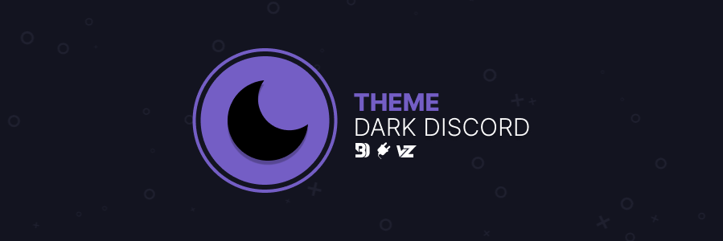

  <p align="center">
    <a href="https://discord.gg/pmpVeAEsxz"></a>
    <a href="">
    <a href="https://github.com/snappercord/Dark-Discord/stargazers">
    <a href=""></a>
    <a href="https://google.com"></a>
  </p>
  


---
# Dark Discord

A simple theme that aims to keep the look and feel of native discord... but darker.


---

## Install

[**Powercord**](https://powercord.dev/) or [**Vizality**](https://vizality.com/) :
```
git clone https://github.com/snappercord/dark-discord
```

[**BetterDiscord**](https://betterdiscord.net/home/) : <br/> 

[Direct Download](https://betterdiscord.net/ghdl?id=3476) | [Source](https://raw.githubusercontent.com/snappercord/Dark-Discord/BetterDiscord/darkdiscord.theme.css)

**Web** :
* Install **Stylus** | [Chrome](https://chrome.google.com/webstore/detail/stylus/clngdbkpkpeebahjckkjfobafhncgmne) | [Firefox](https://addons.mozilla.org/en-US/firefox/addon/styl-us/) | [Opera](https://github.com/openstyles/stylus/wiki/Opera,-Outdated-Stylus)
* Visit [This link](https://raw.githubusercontent.com/snappercord/userstyles/master/Dark-Discord-Web.user.css)
* Install the style directly into your browser


## Credits

[@dperolio](https://github.com/dperolio) for the amazing [vizality banner template](https://www.figma.com/community/file/937081422569421176), along with some design inspo from the beatiful repositories over at [github/vizality-community](https://github.com/vizality-community). <br/>  

[@luckfire](https://github.com/luckfire) for [luckfire/theme-source](https://github.com/LuckFire/Theme-Source), Theme Source is an early development project luckfire and I have been working on to achieve a simple alternative to the default discord look, using your favorite colors. <br/>   

[@aagaming00](https://github.com/aagaming00) for the super cool [live preview system](https://github.com/AAGaming00/discord-theme-preview).